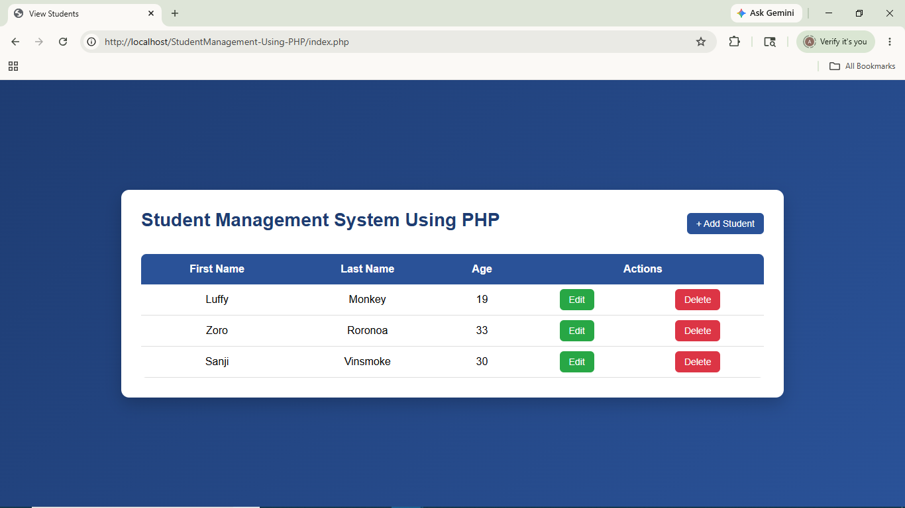
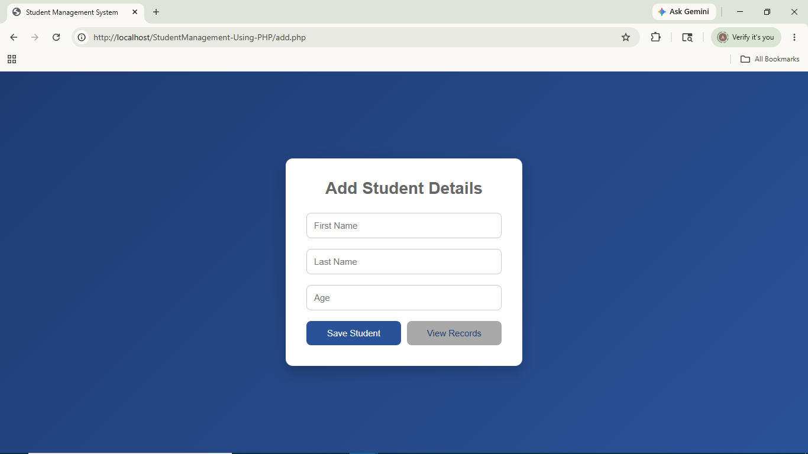
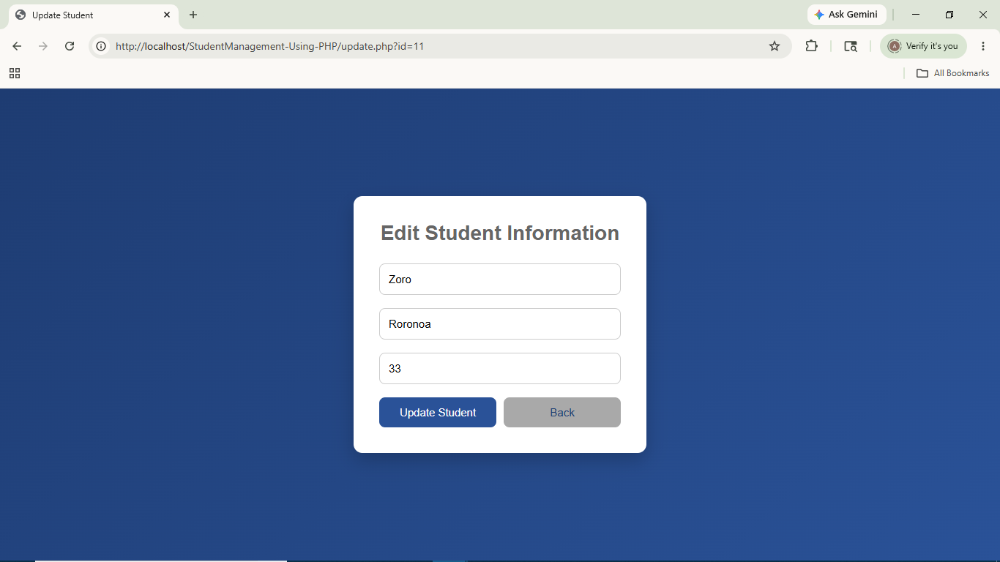

# 🎓 Student Management System Using PHP & MySQL


A simple PHP-based CRUD web application that demonstrates database connectivity using **MySQL**, **PHP MySQLi**, and externalized SQL queries loaded from a dedicated SQL file.

The application allows users to perform complete **Create, Read, Update, and Delete (CRUD)** operations on student records through a clean and responsive user interface.

---

## 🌐 Live Demo

🔗 https://phpstudentmanager.infinityfreeapp.com/

---

## ✨ Features

- Add new student records
- View all student records
- Update existing student details
- Delete student records
- PHP MySQLi database connectivity
- Responsive UI using HTML & CSS
- Confirmation prompt before deletion
- Simple and beginner-friendly project structure
- Apache server deployment using Laragon/XAMPP
- Externalized SQL queries using `SQLqueries.sql`

---

## 🚀 Tech Stack

- PHP
- MySQL
- MySQLi
- HTML5
- CSS3
- Apache Server
- Laragon / XAMPP
- VS Code

---

## 🏗️ Project Architecture

The application follows a simple procedural architecture where:

- PHP handles request processing and page rendering.
- MySQL stores student records.
- SQL statements are maintained separately in `SQLqueries.sql`.
- `SqlLoader.php` loads named SQL queries into the application.
- HTML and CSS provide the user interface.

---

## 🗂️ Project Structure

```text
StudentManagementSystem-Using-PHP-MySql/
│
├── index.php
├── add.php
├── insert.php
├── update.php
├── delete.php
├── connection.php
├── SqlLoader.php
├── SQLqueries.sql
├── style.css
├── README.md
└── .gitignore
```

---

## ⚙️ Database Information

This project uses a MySQL database named:

```text
student_manager
```

### Table Schema

```sql
CREATE TABLE students (
    id INT AUTO_INCREMENT PRIMARY KEY,
    firstname VARCHAR(50),
    lastname VARCHAR(50),
    age INT
);
```

---

## ▶️ Running the Application

### Prerequisites

- PHP
- MySQL
- Apache Server
- Laragon / XAMPP

---

### Steps

#### 1. Clone Repository

```bash
git clone https://github.com/Atharva-Shelke/StudentManagement-Using-PHP-MySql
```

---

#### 2. Move Project Folder

Place the project folder inside:

```text
C:\laragon\www\
```

or

```text
C:\xampp\htdocs\
```

---

#### 3. Start Server

Start:

- Apache
- MySQL

from Laragon/XAMPP.

---

#### 4. Create Database

Open phpMyAdmin and create database:

```sql
CREATE DATABASE student_manager;
```

---

#### 5. Create Table

```sql
CREATE TABLE students (
    id INT AUTO_INCREMENT PRIMARY KEY,
    firstname VARCHAR(50),
    lastname VARCHAR(50),
    age INT
);
```

---

#### 6. Run Application

Open browser:

```text
http://localhost/student-management-system
```

---

## 📸 Output

### Student Records Page


### Add Student Page


### Update Student Page


---

## 📖 Learning Objectives

This project demonstrates:

- PHP CRUD operations
- MySQL database integration
- SQL query execution using MySQLi
- Form handling in PHP
- Dynamic data rendering using PHP
- Frontend styling using CSS
- Basic client-side interaction using JavaScript alerts
- Web application deployment using Apache server
- Separating SQL queries from application logic

---

## 📌 Note

This project is intentionally implemented using **core PHP and MySQLi without frameworks** to demonstrate strong understanding of CRUD operations, SQL queries, and server-side scripting fundamentals.
